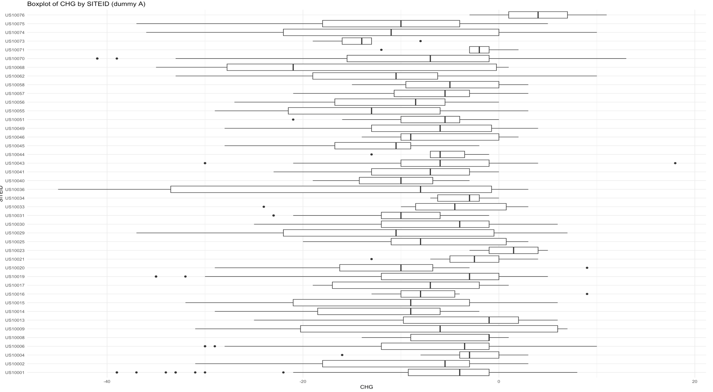
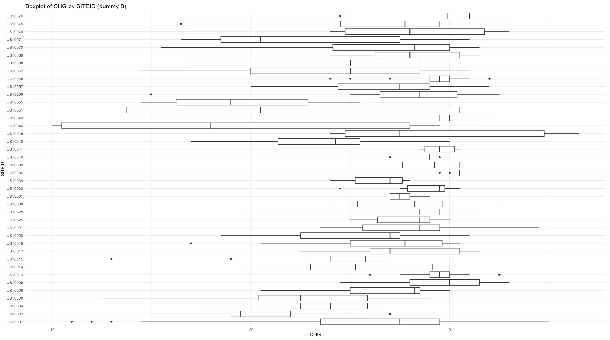
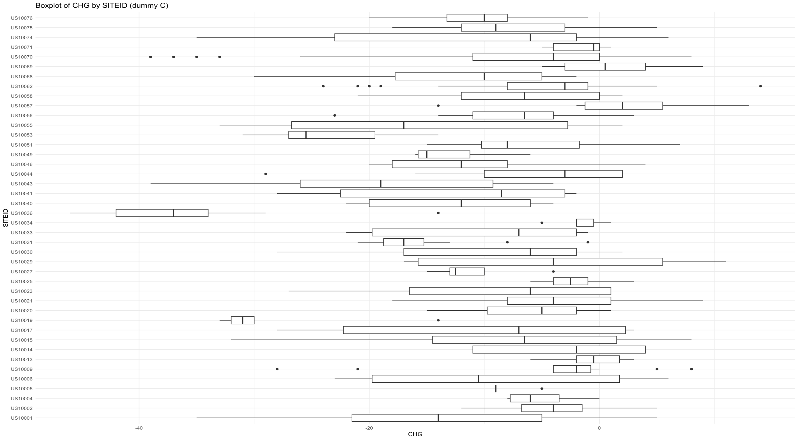
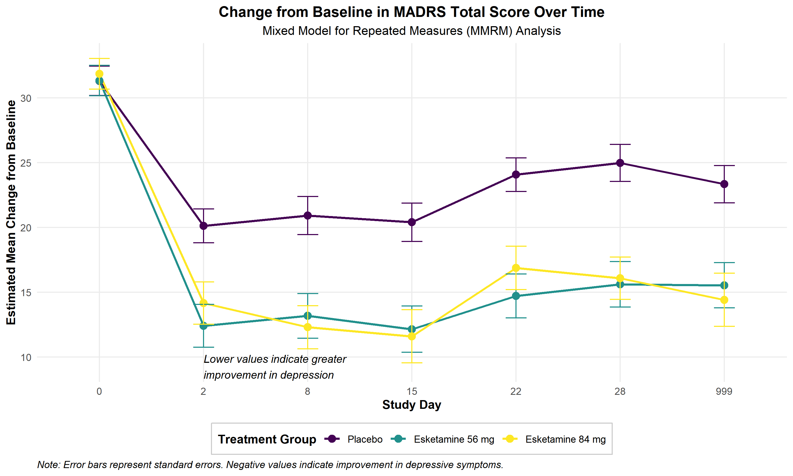
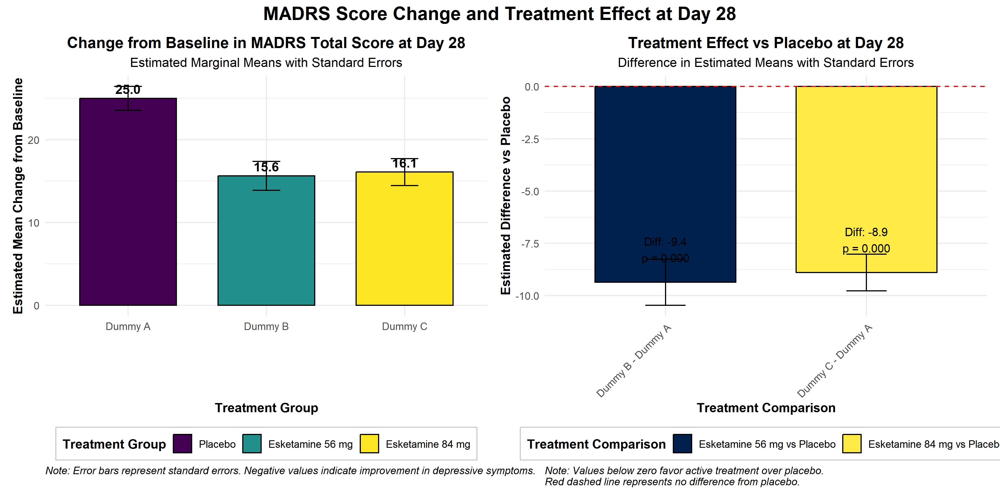
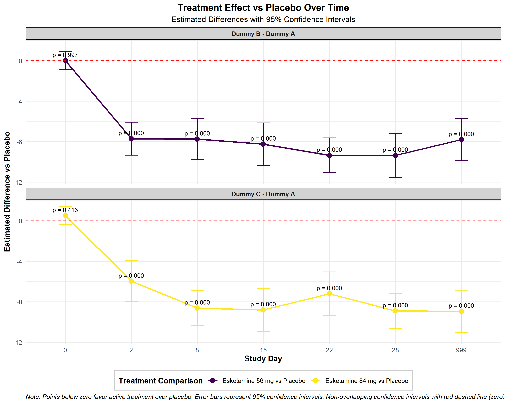
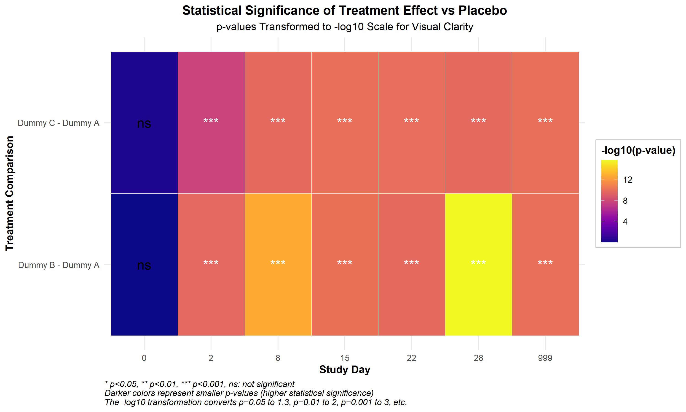
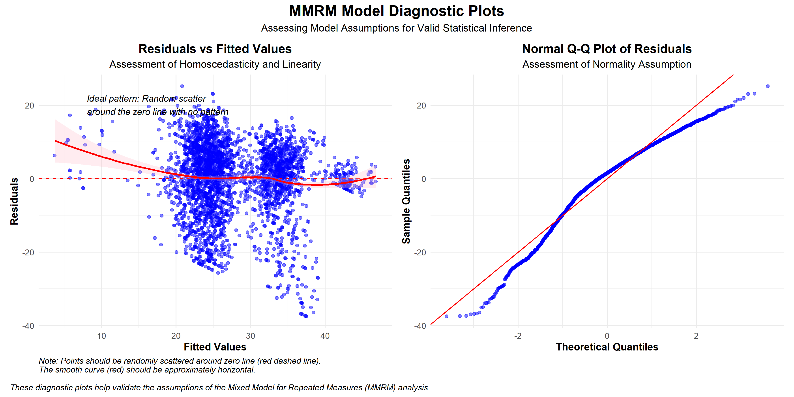
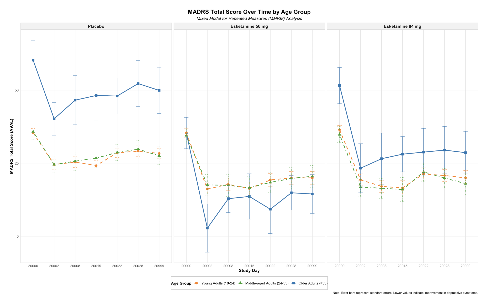
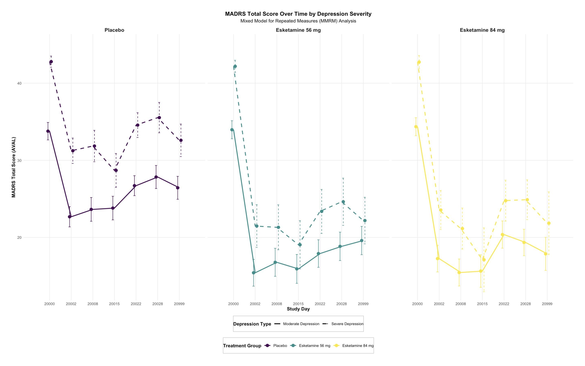

 \

- [Codes of MMRM and Emmeans](Biostatistics-competition.html)

 \

- [Codes of Subgroup Analysis](Subgroups.html)

 \

Descriptive Analysis

 \
 

MADRS Change Over Time:

 \

 

Treatment Effect(Day 28):

 \

Treatment Effect Forest Plot:

 \

Treatment Significance Heatmap:

 \

MMRM Model Diagnostic plots:

Subgroup Analysis: Age

 \

Subgroup Analysis: Depression Severity

